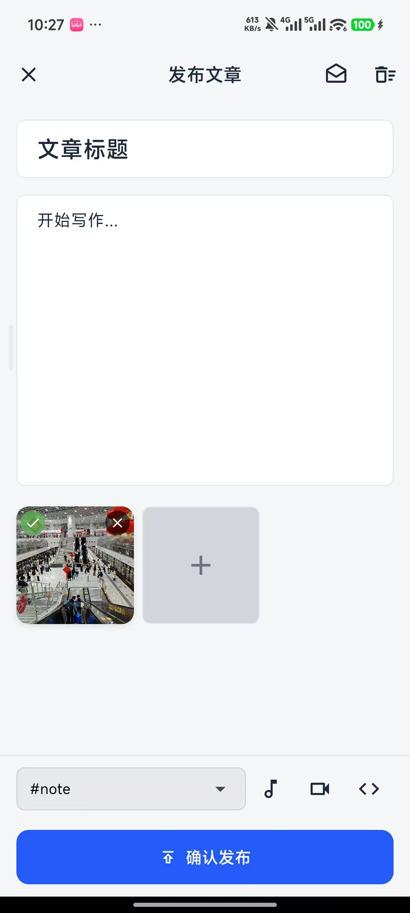
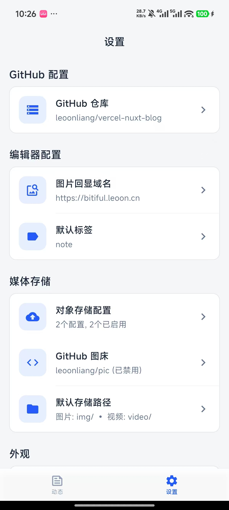

# GitHub Issue Editor

<div align="center">

[](https://flutter.dev)
[](https://dart.dev)
[](#-许可证)
[](https://www.android.com)

**一款优雅的 GitHub Issues 移动端编辑器，专为通过 Issues 管理博客的用户打造**

[在线演示](https://leoonliang.github.io/github-issue-editor/) • [功能特性](#-特性) • [快速开始](#-开始使用) • [下载 APK](https://github.com/leoonliang/github-issue-editor/releases)

</div>

---

## 📱 应用简介

GitHub Issue Editor 是一款专为移动端优化的 GitHub Issues 管理工具，如果你通过 GitHub Issues 管理博客，它将帮助你快速发布图文并茂的精美文章。

### ✨ 核心亮点

- 🎨 **全新 iOS 风格 UI** - 精致的现代化设计，支持浅色/深色主题
- 📸 **强大的媒体支持** - 支持多图上传、视频、实况照片、拖拽排序
- ☁️ **灵活的图床方案** - 支持 S3 兼容存储和 GitHub 图床，可并行上传
- 💾 **智能草稿系统** - 自动保存，永不丢失创作内容
- 🔄 **无限滚动加载** - 流畅浏览所有文章
- 🏷️ **标签筛选** - 快速定位目标文章

## 📸 应用截图

<div align="center">

<table>
  <tr>
    <td align="center"><br/><sub><b>文章列表</b></sub></td>
    <td align="center"><br/><sub><b>发布文章</b></sub></td>
    <td align="center"><br/><sub><b>设置页面</b></sub></td>
  </tr>
</table>

**[👉 在线交互演示](https://leoonliang.github.io/github-issue-editor/)** - 在浏览器中体验完整功能

</div>

## ✨ 特性

### 📱 核心功能
- **GitHub Issues 管理** - 查看、创建、编辑 GitHub Issues
- **标签筛选** - 按标签和状态（open/closed）筛选 Issues
- **无限滚动** - 自动加载更多 Issues，流畅浏览体验
- **富文本编辑** - 支持 Markdown 格式编辑

### 🎨 媒体支持
- **多种图床支持** - 支持 S3 兼容存储和 GitHub 图床
  - AWS S3 / 阿里云 OSS / 七牛云 / Bitiful 等 S3 兼容服务
  - GitHub 仓库作为图床（每张图片一个 commit）
  - 支持多个图床同时启用，并行上传
- **图片上传** - 支持多图上传，可独立启用/禁用不同图床
- **相机拍照** - 支持相机拍照，拍照后可选择直接上传或编辑
- **图片编辑** - 支持编辑已选择的图片（Pro Image Editor）
- **九宫格展示** - 类朋友圈的图片网格布局
- **拖拽排序** - 自由调整图片顺序
- **视频支持** - 上传和预览视频内容
- **实况照片** - 支持小米实况照片（编辑时保留原视频）
  > ⚠️ **注意**：Live Photo 功能目前仅支持小米手机的实况照片，其他品牌手机未经验证
- **ThumbHash 预览** - 图片加载前显示模糊占位图
- **自定义存储路径** - 可配置图片和视频的存储路径前缀

### 💾 实用功能
- **草稿保存** - 自动保存文字和已上传图片
- **版本检查** - 自动检查并提示应用更新
- **自定义相册** - 内置照片选择器，支持多选和预览
- **配置导入导出** - 支持配置备份和恢复

### 🎨 设计风格
- **全新 iOS 风格 UI** - 采用 iOS 风格的底部抽屉设计
- **主题系统** - 支持浅色、深色和跟随系统三种主题模式
- **精致配色** - 红色主题色搭配专业的浅色/深色配色方案
- **流畅动画** - 优化的交互动画和过渡效果
- **现代设计** - 简洁现代的 Material Design


## 📝 输出格式

本应用发布的 GitHub Issue 内容采用增强的 Markdown 格式，包含标题、正文和富媒体信息。

### 文章结构

```markdown
# 文章标题

这是文章的正文内容，支持完整的 Markdown 语法。

可以包含多段文字、列表、引用等格式。

{width=4096 height=3072 thumbhash="5xgOFYLHqZeKiHePdYZ4dhWCkDAG"}

{liveVideo="https://example.com/video.mp4" width=4096 height=3072 thumbhash="XQgKDYL6mFiTybdFZnipeZPgIAgP"}
```

### 图片格式说明

图片使用扩展的 Markdown 语法，在标准图片语法后附加元数据：

**普通图片：**
```markdown
{width=4096 height=3072 thumbhash="5xgOFYLHqZeKiHePdYZ4dhWCkDAG"}
```
- `width` / `height` - 图片原始尺寸
- `thumbhash` - 图片占位符哈希（用于加载前显示模糊预览）

**Live Photo（实况照片）：**
```markdown
{liveVideo="https://your-cdn.com/video/example2.mp4" width=4096 height=3072 thumbhash="XQgKDYL6mFiTybdFZnipeZPgIAgP"}
```
- `liveVideo` - 实况视频的 URL（小米实况照片）
- 其他参数同普通图片

**竖图示例：**
```markdown
{width=3072 height=4096 thumbhash="YhgOFQJpiZuH+JinhnR3h3pg+QgW"}
```

> 💡 **提示**：这些元数据虽然在标准 Markdown 渲染器中不会显示，但可以被支持的博客系统解析，用于优化图片加载体验和实现实况照片播放功能。

## 🚀 开始使用

### 方式一：直接下载 APK（推荐）

前往 [Releases](https://github.com/leoonliang/github-issue-editor/releases) 页面下载最新版本的 APK 文件，直接安装即可使用。

### 方式二：从源码编译

#### 前置要求

- Flutter SDK >= 3.5.2
- Dart SDK >= 3.5.2
- Android Studio / Xcode（用于移动端开发）

### 安装步骤

1. **克隆仓库**
   ```bash
   git clone https://github.com/leoonliang/github-issue-editor.git
   cd github-issue-editor
   ```

2. **安装依赖**
   ```bash
   flutter pub get
   ```

3. **配置 GitHub**

   启动应用后，在设置页面配置：
   - GitHub Token（需要 repo 权限）
   - 仓库所有者
   - 仓库名称

4. **配置图床（必选其一）**

   本应用支持两种图床方式，至少需要配置一种：

   **方式一：S3 兼容对象存储**
   - Access Key ID
   - Secret Access Key
   - Bucket 名称
   - Region
   - Endpoint

   **方式二：GitHub 图床**
   - GitHub Token（需要 repo 权限）
   - 仓库所有者
   - 仓库名称
   - 分支名称（默认 main）

   > 💡 **提示**：两种方式可以同时启用，系统会并行上传到所有启用的图床

5. **运行应用**
   ```bash
   flutter run
   ```

## 🛠️ 技术栈

### 核心框架
- **Flutter** - Google 开发的跨平台 UI 框架
- **Dart** - Flutter 使用的编程语言
- **Riverpod** - 先进的状态管理解决方案

### 主要功能库

| 依赖包 | 版本 | 用途 |
|-------|------|------|
| flutter_riverpod | ^2.6.1 | 状态管理 |
| flutter_quill | - | Markdown 富文本编辑 |
| image_picker | - | 图片/视频选择 |
| photo_manager | - | 相册管理 |
| video_player | - | 视频播放 |
| aws_s3_api | - | S3 兼容对象存储上传 |
| cached_network_image | - | 网络图片缓存 |
| thumbhash | - | 图片模糊占位符 |
| reorderables | - | 拖拽排序 |
| package_info_plus | - | 应用版本信息 |
| url_launcher | - | 打开外部链接 |
| photo_view | - | 图片预览和缩放 |
| pro_image_editor | - | 图片编辑功能 |

### UI & 设计
- **Material Design** - Google 设计语言
- **iOS 风格设计** - 底部抽屉、圆角卡片等现代化 UI 元素
- **主题系统** - 支持浅色/深色/跟随系统

## 🏗️ 项目结构

```
lib/
├── components/          # 可复用组件
│   └── markdown_editor.dart
├── models/             # 数据模型
│   ├── app_config.dart
│   ├── issue_image_info.dart
│   └── upload_models.dart
├── providers/          # Riverpod 状态管理
│   ├── config_provider.dart
│   ├── github_provider.dart
│   ├── labels_provider.dart
│   ├── theme_provider.dart
│   └── upload_provider.dart
├── screens/            # 页面
│   ├── issue_list_screen.dart
│   ├── main_screen.dart
│   ├── publish_screen.dart
│   └── settings_screen.dart
├── services/           # 业务逻辑
│   ├── github.dart
│   ├── github_image_service.dart
│   ├── imageProcessService.dart
│   └── version_service.dart
├── theme/              # 主题系统
│   ├── app_colors.dart
│   └── app_theme.dart
└── widgets/            # 自定义组件
    ├── image_grid_preview.dart
    ├── image_grid_widget.dart
    ├── image_preview_dialog.dart
    ├── issue_card.dart
    ├── oss_config_dialog.dart
    └── search_bar_widget.dart
```

## 🔧 配置说明

### 快速导入配置（推荐）

为了方便快速配置，我们提供了配置模板文件。按照以下步骤操作：

1. **复制配置模板**

   打开项目根目录下的 `config.template.json` 文件，复制其内容：

   ```json
   {
       "github": {
           "owner": "your-github-username",
           "repo": "your-repo-name",
           "token": "ghp_your_github_personal_access_token_here"
       },
       "ossList": [
           {
               "name": "bitiful",
               "endpoint": "https://s3.bitiful.net",
               "region": "cn-east-1",
               "accessKeyId": "your_bitiful_access_key_id",
               "secretAccessKey": "your_bitiful_secret_access_key",
               "bucket": "your-bucket-name",
               "publicDomain": "",
               "enabled": true
           },
           {
               "name": "qiniu",
               "endpoint": "https://s3.cn-south-1.qiniucs.com",
               "region": "cn-south-1",
               "accessKeyId": "your_qiniu_access_key_id",
               "secretAccessKey": "your_qiniu_secret_access_key",
               "bucket": "your-bucket-name",
               "publicDomain": "",
               "enabled": true
           }
       ],
       "githubImage": {
           "owner": "your-github-username",
           "repo": "your-image-repo-name",
           "token": "ghp_your_github_personal_access_token_here",
           "branch": "main",
           "enabled": true
       },
       "editor": {
           "displayDomain": "https://your-domain.com",
           "defaultLabel": "article",
           "imagePrefix": "img",
           "videoPrefix": "video"
       }
   }
   ```

2. **填写配置信息**

   将模板中的占位符替换为您的实际信息：

   **GitHub 配置：**
   - `your-github-username` → 您的 GitHub 用户名
   - `your-repo-name` → 用于发布文章的仓库名称
   - `ghp_your_github_personal_access_token_here` → 您的 GitHub Token

   **对象存储配置（可选）：**
   - `your_bitiful_access_key_id` → Bitiful Access Key ID
   - `your_bitiful_secret_access_key` → Bitiful Secret Access Key
   - `your_qiniu_access_key_id` → 七牛云 Access Key ID
   - `your_qiniu_secret_access_key` → 七牛云 Secret Access Key
   - `your-bucket-name` → 您的存储桶名称

   **GitHub 图床配置（可选）：**
   - `your-image-repo-name` → 用于存储图片的仓库名称
   - GitHub Token 和用户名可与上面的 GitHub 配置相同

   **编辑器配置：**
   - `your-domain.com` → 您的图片回显域名（CDN 域名）
   - `article` → 默认标签（发布时自动选择）
   - `img` / `video` → 存储路径前缀（可自定义）

3. **导入配置**

   - 复制填写好的 JSON 配置
   - 打开应用，进入**设置** → **维护** → **备份与恢复** → **导入配置**
   - 粘贴 JSON 配置并导入

   > 💡 **提示**：您可以根据实际需求删除或添加 OSS 配置项，支持多个对象存储服务。

### GitHub 权限

需要创建具有以下权限的 GitHub Personal Access Token：
- `repo` - 完整的仓库访问权限（用于读写 Issues）

创建 Token：[GitHub Settings > Developer settings > Personal access tokens](https://github.com/settings/tokens)

### 图床配置

本应用支持两种图床方式：

#### 方式一：S3 兼容对象存储

支持任何兼容 S3 API 的对象存储服务，包括但不限于：
- AWS S3
- Bitiful
- 七牛云 S3
- 阿里云 OSS（S3 兼容模式）
- MinIO
- 腾讯云 COS（S3 兼容模式）

**配置要点：**
1. 创建存储桶并设置为公开读取（或配置 CDN）
2. 创建访问密钥（Access Key 和 Secret Key）
3. 确保密钥具有上传文件的权限
4. 配置正确的 Endpoint 和 Region

#### 方式二：GitHub 图床

使用 GitHub 仓库作为图床，适合小流量博客：

**优点：**
- ✅ 免费且稳定
- ✅ 无需配置对象存储
- ✅ 支持版本管理
- ✅ 可通过 jsDelivr 等 CDN 加速

**配置要点：**
1. 创建专门的图片仓库（或使用现有仓库）
2. 创建具有 `repo` 权限的 Personal Access Token
3. 每次上传会创建一个 commit
4. 图片 URL 格式：`https://raw.githubusercontent.com/owner/repo/branch/path/to/image.jpg`

**使用建议：**
- 图片数量较少时推荐使用 GitHub 图床
- 图片数量较多或需要高速访问时推荐使用 S3 对象存储
- 可以同时启用多个图床，系统会并行上传

## 📱 支持平台

> ⚠️ **重要提示**：本应用目前仅在**小米手机**上进行过完整测试和适配，其他品牌 Android 手机和 iOS 设备可能存在兼容性问题。

- ✅ Android（小米手机已测试）
- ⚠️ Android（其他品牌未验证）
- ⚠️ iOS（未充分测试）
- ❌ Web（图片选择器不支持）
- ❌ macOS（未适配）

## 🔄 版本更新

应用内置版本检查功能，会从 GitHub Releases 自动检查更新：
- 在设置页面点击"检查更新"
- 如有新版本，会显示更新说明和下载链接
- 支持直接下载 APK 文件（Android）

## 🗺️ 开发路线

- [ ] iOS 平台完整适配和测试
- [ ] 其他 Android 品牌手机适配
- [ ] 图片压缩和优化功能
- [ ] 更多 Markdown 编辑功能
- [ ] 评论管理功能
- [ ] 文章统计和分析
- [ ] 批量操作支持

## ❓ 常见问题

<details>
<summary><b>为什么选择通过 GitHub Issues 管理博客？</b></summary>

- ✅ 免费且稳定的内容存储
- ✅ 自带评论系统（Issue Comments）
- ✅ 自动版本控制和历史记录
- ✅ 支持 Markdown 格式
- ✅ 可以通过 GitHub Pages 或其他静态网站生成器展示
- ✅ 支持 GitHub Actions 自动化部署

</details>

<details>
<summary><b>图床选择建议？</b></summary>

**小流量博客（推荐 GitHub 图床）：**
- 免费且稳定
- 配置简单
- 支持 CDN 加速（jsDelivr、Statically 等）

**高流量博客或大量图片（推荐对象存储）：**
- 访问速度更快
- 流量控制更灵活
- 支持更多功能（如图片处理）

**最佳实践：**
- 同时启用 GitHub 图床和对象存储
- 系统会并行上传，确保至少一个成功
- 提供更好的可靠性

</details>

<details>
<summary><b>为什么实况照片只支持小米手机？</b></summary>

实况照片（Live Photo）功能依赖于手机厂商的实现方式。目前仅在小米手机上进行了完整测试和适配。其他品牌的实况照片格式可能不同，暂未验证兼容性。

</details>

<details>
<summary><b>如何备份我的配置？</b></summary>

1. 打开应用，进入**设置** → **维护** → **备份与恢复**
2. 点击**导出配置**
3. 复制生成的 JSON 配置并保存到安全位置
4. 需要恢复时，使用**导入配置**功能粘贴 JSON 即可

</details>

## 🤝 贡献

欢迎提交 Issue 和 Pull Request！

### 如何贡献

1. Fork 本仓库
2. 创建您的特性分支 (`git checkout -b feature/AmazingFeature`)
3. 提交您的更改 (`git commit -m 'Add some AmazingFeature'`)
4. 推送到分支 (`git push origin feature/AmazingFeature`)
5. 打开一个 Pull Request

### 开发规范

- 遵循 Flutter 官方代码规范
- 提交前运行 `flutter analyze` 和 `flutter test`
- Pull Request 请提供清晰的描述和测试说明

## 👨‍💻 作者

**leoonliang**
- 📧 Email: dsleoon@gmail.com
- 🐙 GitHub: [@leoonliang](https://github.com/leoonliang)
- 🌐 在线演示: [GitHub Pages](https://leoonliang.github.io/github-issue-editor/)

## 📄 许可证

本项目仅供个人学习和研究使用。

## 🔗 相关链接

- [GitHub Issues API 文档](https://docs.github.com/en/rest/issues)
- [Flutter 官方文档](https://flutter.dev/docs)
- [AWS S3 API 文档](https://docs.aws.amazon.com/s3/)
- [jsDelivr CDN](https://www.jsdelivr.com/) - GitHub 图床加速方案

## ⭐ Star 历史

如果这个项目对你有帮助，请给一个 Star ⭐️

[](https://star-history.com/#leoonliang/github-issue-editor&Date)


## 💝 致谢

感谢以下开源项目：

- [Flutter](https://flutter.dev) - 优秀的跨平台框架
- [Riverpod](https://riverpod.dev) - 强大的状态管理
- [Flutter Quill](https://github.com/singerdmx/flutter-quill) - 富文本编辑器
- [Pro Image Editor](https://github.com/hm21/pro_image_editor) - 图片编辑功能
- 以及所有其他依赖库的作者们

## 📝 更新日志

### v2.1.0 (2026-02-06)

#### 🎨 UI 全面改版
- ✨ 全新 iOS 风格底部抽屉设计
- ✨ 完整的主题系统（浅色/深色/跟随系统）
- ✨ 重新设计的文章列表页面
- ✨ 优化的设置页面布局
- ✨ 改进的图片预览体验（使用 PhotoViewGallery）

#### 🌐 图床功能增强
- ✨ **新增 GitHub 图床支持**，可将 GitHub 仓库作为图床使用
- ✨ 支持 S3 和 GitHub 图床并行上传，任一成功即可
- ✨ 支持独立启用/禁用不同的图床
- ✨ **新增存储路径前缀配置**，支持自定义图片/视频存储路径
- 🐛 修复单独使用 GitHub 图床时无法上传的问题

#### 📸 相机与编辑
- ✨ 新增相机拍照功能
- ✨ 支持拍照后直接上传或编辑
- ✨ 优化图片编辑流程

#### 🏷️ 标签与筛选
- ✨ 筛选功能重构，支持按标签筛选文章
- ✨ 默认标签同步，发布时自动选择默认标签
- ✨ 优化标签选择和图片上传体验

#### 🐛 Bug 修复
- 🐛 修复 updateGitHubIssue 参数传递问题
- 🐛 修复 GitHubService 构造函数调用错误
- 🐛 修复九宫格显示问题
- 🐛 恢复完整 OSS 配置功能

### v2.0.1 (2026-01-22)
- ✨ 新增图片编辑功能，支持编辑已选择的图片
- ✨ 新增 Live Photo 编辑支持（编辑静态图片时保留原视频）
- ✨ 新增实时草稿保存（自动保存文字和已上传图片）
- ✨ 优化配置导入体验（改为弹窗输入，提供格式提示）
- 🐛 修复草稿加载时图片重复累加的问题
- 🐛 修复清空草稿时图片未清空的问题
- 🐛 修复导入配置点击取消时的报错
- ⚡ 优化发布页面键盘弹出性能

### v2.0.0 (2026-01-20)
- ✨ 新增草稿保存功能（自动保存和恢复）
- ✨ 新增版本检查和自动更新功能
- ✨ 优化图片网格布局，简化添加按钮设计
- ✨ 实现无限滚动加载，流畅浏览体验
- ✨ 优化文章列表展示（内容优先，彩色标签）
- ✨ 发布页面独立，移除底部导航
- ✨ 文章列表新增浮动发布按钮
- ✨ 新增关于页面（作者信息、版本信息）
- 🐛 修复视频预览页面显示实况按钮的问题
- 🐛 修复无限滚动分页失效的问题

### v1.0.0
- 🎉 初始版本发布
- ✨ GitHub Issues 基础管理功能
- ✨ 图片和视频上传
- ✨ 九宫格拖拽排序
- ✨ 实况照片支持

---

Made with ❤️ by leoonliang
